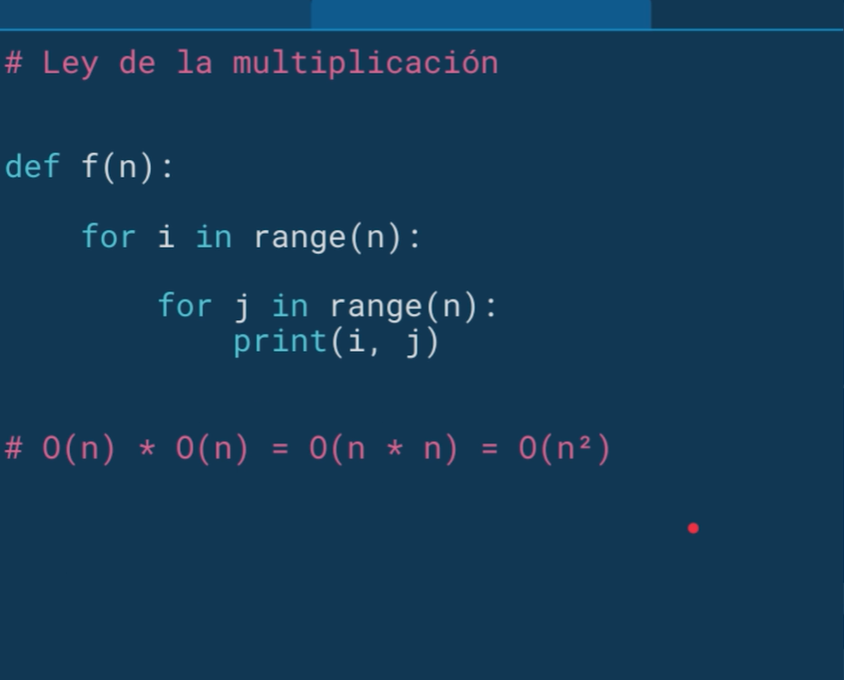

## Introduction to Curse

Objectives

- Entender como funciona la programación orientada a objetos
- Entender como medir la eficiencia temporal y espacial de nuestros algoritmos
- Aprender a resolver problemas de búsquedad, ordenación y optimización.

## Programación orientada a objetos

Uno de los elementos más importantes de los lenguajes de programación
es la utilización de clases para organizar programas en módulos y abstracciones
de datos.

Las clases se pueden utilizar de muchas diversas maneras. Pero en este artículo
hablaremos de cómo utilizarlas en el contexto de la programación orientada a objetos.
La clave para entender la programación orientada a objetos es pensar en objetos
como agrupaciones de datos y los métodos que operan en dichos datos.

Por ejemplo, podemos representar a una persona con propiedades como nombre,
edad, género, etc. y los comportamientos de dicha persona como caminar, cantar,
comer, etc. De la misma manera podemos representar unos audifonos con propieades
como su marca, tamaño, color, etc. y sus comportamientos como reproducir música,
pausar y avanzar a la siguiente canción.

Puesto de otra manera, la programación orientada a objetos nos permite modelar
cosas reales y concretas del mundo y sus relaciones con otros objetos.

Las ideas detrás de la progrmación orientada a objetos tienen más de 50 años
y han sido ampliamente aceptadas y practicadas en los últimos treinta. A
mediados de la década de los setenta se comenzaron a escribir artículos académicos
explicando los beneficios de esta aproximación a la programación. También durante
esos años se comenzaron a escribir los primeros lenguajes de programación que
incorporaban estas ideas (como Smalltalk y CLU). Pero no fue hasta la llegada
de Java y C++ que la idea consiguió un número importante de seguidores.

Hasta ahora, en el curso previo de esta serie
hemos utilizado programación orientada a objetos de manera implícita. Cuando
decimos “Los objetos son las principales cosas que un programa de Python
manipula. Cada objeto tiene un tipo que define qué cosas puede realizar un
programa con dicho objeto.”, nos estamos refiriendo a las ideas principales
de la programación orientada a objetos. Hemos utilizado los tipos lista y
diccionario, entre muchos otros, así como los métodos asociados a dichos tipos.
Así como los creadores de un lenguaje de programación sólo pueden diseñar una
fracción muy pequeña de todas las funciones útiles (como abs, float, type,
etc.), también pueden escribir una fracción muy pequeña de los tipos útiles
`(int, str, dict, list, etc.)`. Ya sabemos los mecanismos que nos
permiten crear funciones, ahora veremos los mecanismos que nos permiten crear
nuevos tipos (o clases).

### Clases en Python

Las estructuras primitivas con las que hemos trabajado hasta ahora nos permiten
definir cosas sencillas, como el costo de algo, el nombre de un usuario, las
veces que debe correr un bucle, etc. Sin embargo, existen ocasiones cuando
necesitamos definir estructuras más complejas, por ejemplo un hotel. Podríamos
utilizar dos listas: una para definir los cuartos y una segunda para definir
si el cuarto se encuentra ocupado o no.

```python
cuartos_de_hotel = [101, 102, 103, 201, 202, 203]
cuarto_ocupado = [True, False, False, True, True, False]
```

Sin embargo, este tipo de organización rápidamente se sale de control. ¿Qué
tal que quisieramos añadir más propiedades, cómo si el cuarto ya fue aseado o
no? ¿Si el cuarto tiene cama doble o sencilla? Esto nos lleva a una falta fuerte
de organización y es justamente el punto que justifica la existencia de clases.

Las clases nos permiten crear nuevos tipos que contiene información arbitraria
sobre un objeto. En el caso del hotel, podríamos crear dos clases Hotel() y
Cuarto() que nos permitiera dar seguimiento a las propiedades como número de
cuartos, ocupación, aseo, tipo de habitación, etc.

Es importante resaltar que las clases sólo proveen estructura. Son un molde con
el cual podemos construir objetos específicos. La clase señala las propiedades
que los hoteles que modelemos tendrán, pero no es ningún hotel específico. Para
eso necesitamos las instancias.

### Instancias

Mientras que las clases proveen la estructura, las instancias son los objetos
reales que creamos en nuestro programa: un hotel llamado PlatziHotel o Hilton.
Otra forma de pensarlo es que las clases son como un formulario y una vez que
se llena cada copia del formulario tenemos las instancias que pertenecen a
dicha clase. Cada copia puede tener datos distintos, al igual que cada instancia
es distinta de las demás (aunque todas pertenecen a una misma clase).

Para definir una clase, simplemente utilizamos el _keyword_ `class`. Por ejemplo:

```python
class Hotel:
    pass
```

Una vez que tenemos una clase llamada `Hotel` podemos generar una instancia
llamando al constructor de la clase.

```python
hotel = Hotel()
```

### Atributos de la instancia

Todas las clases crean objetos y todos los objetos tienen atributos. Utilizamos
el método especial `__init__` para definir el estado inicial de nuestra instancia.
Recibe como primer parámetro obligatorio `self` (que es simplemente una
referencia a la instancia).

```python
class Hotel:

    def __init__(self, numero_maximo_de_huespedes, lugares_de_estacionamiento):
        self.numero_maximo_de_huespedes = numero_maximo_de_huespedes
        self.lugares_de_estacionamiento = lugares_de_estacionamiento
        self.huespedes = 0


hotel = Hotel(numero_maximo_de_huespedes=50, lugares_de_estacionamiento=20)
print(hotel.lugares_de_estacionamiento) # 20
```

### Métodos de instancia

Mientras que los atributos de la instancia describen lo que representa el
objeto, los métodos de instancia nos indican qué podemos hacer con las
instancias de dicha clase y normalmente operan en los mencionados atributos.
Los métodos son equivalentes a funciones dentro de la definición de la clase,
pero todos reciben `self` como primer argumento.

```python
class Hotel:

    ...

    def anadir_huespedes(self, cantidad_de_huespedes):
        self.huespedes += cantidad_de_huespedes

    def checkout(self, cantidad_de_huespedes):
        self.huespedes -= cantidad_de_huespedes

    def ocupacion_total(self):
        return self.huespedes


hotel = Hotel(50, 20)
hotel.anadir_huespedes(3)
hotel.checkout(1)
hotel.ocupacion_total() # 2
```

Ahora que ya sabemos qué son las clases y cómo las podemos utilizar en nuestros
programas, platícanos qué clases te serían útiles para modelar en uno de tus
programas.

## Tipos de datos abstractos

En python todo es un objeto y todo tiene un tipo, significa que todo lo que nosotros hacemos dentro de nuestro programa tiene una representación en memoria y el hecho de que todo tenga un tipo significa que nosotros podemos encapsular los datos como el comportamiento adentro de un solo objeto.

Cuando nosotros pensamos en tipos tenemos que entender que esta teoria viene desde las mátematicas y los tipos en la actualidad nos permiten modelar completamente al mundo, existe el tipo: {humano, camara, automóvil, avión, etc.}

Si nosotros vemos un restaurante significa que el restaurante puede estar lleno, o vacío, puede tener color rojo o color amarillo, puede estar sirviendo en ese momento comida o puede estar en verdad limpiandose, entonces si te das cuenta todo a tu alrededor tiene un tipo y python atraves de la programación orientada a objetos nos permite empezar a modelar el mundo de esta manera.

- En Python todo es un objeto y tiene un tipo
  - Representación de datos y formas de interactuar con ellos.
- Formas de interactuar con un objeto:
  - Creación
  - Manipulación
  - Destrucción

En algunos lenguajes de programación tu tienes que directamente destruir la referencia a esos objetos, en pytho simplemente cuando un objeto pierde todas sus referencias es decir nadie más en el programa lo esta utilizando, el garbace collector va y lo destruye de la memoria.

- Ventajas
  - Descomposicion
  - Abstracción
  - Encapsulación

<div align="center">
  
</div>

Definición de clases

<div align="center">
  
</div>

### Instancias

Mientras que la clase es un molde, a los objetos se les conoce como instancias, ejemplo: imagina que tienes un molde que hace botellas, entonces la clase es el molde y cada vez que nosotros generamos una botella, esa es una instnacia de la clase, piensalo también en una fabrica, por ejemplo con una impresora 3D, nosotros tenemos los moldes en memoria dentro de la computadora y cuando imprimimos esas son las instancias de la clase, además las instancias pueden tener atributos distintos pero el molde sigue siendo el mismo

- Mientras que la clase es un molde, a los objetos creados se les conoce como instancias.
- Cuando se crea una instancia se ejecuta el método `__init__`
- Todos los métodos reciben como primer párametro self

Sabemos que cada vez que nosotros generamos una nueva instancia se ejecuta el constructor y en python le llamamos donner_init, donner es simplemente una forma que se utiliza en el mundo de python donner_underle es una forma de decir "doble guión bajo".

- Los atributos de clase nos permite:

  - Representar datos
  - Procedimientos para interactuar con los mismos (métodos)
  - Mecanismos para esconder la representación interna.

- Se accede a los atributos con la notación de punto.
- Pueden tener atributos privados. Por convención comienzan con \_

**isinstance**: Nos permite determinar si alguna de estas coordenadas es instancia de Cordenada.

## Abstracción

- Enfocarnos en la información relevante.
- Separar la información central de los detalles secundarios.
- Podemos utilizar variables y métodos (privados o públicos).

Es básicamente enfocarnos en la información relevante, es generar una interfaz en la cuál nosotros podamos interactuar con cualquier tipo de objeto sin quedarnos en los detalles engorrosos o en los detalles técnicos, en la forma en la que este objeto funciona.

La abstracción la vemos en todas partes, piensalo de esta manera: cuando tu estas manejando tu automóvil no te estas preocupando por la forma en la que el motor funciona a detalle, no te preocupas por la forma en la que el motor quema la gasolina, en la forma en la que los pistones se mueven, etc.

### ¿Como nosotros podemos traducir estos conceptos a la programación?

Generando una interfaz, la interfaz con la que nosotros vamos a interactuar directamente con las clases que nosotros estamos utilizando, si fuera de otra forma esto fuera muy dificil implementarlo en la ingeniería de software y nosotros tendríamos que saber a detalle como funcionan todas y cada una de las librería que nosotros utilizamos, la verdad que estos sería una diciplina imposible.

A lo que nosotros nos interesa es saber como nosotros interactuamos con esas librerías, como interactuamos con los servidores, como interactuamos con los algoritmos de machin-learning que utilizamos, como interactuamos con los algoritmos que nos ayudan a procesar datos.

### Abstracción en la Física

La abstracción es una herramienta muy poderosa. La abstracción cuando estamos definiendo por ejemplo como se comporta un gas podriamos ver como se mueven las moléculas como se mueven cada uno de los materiales, pero lo único que importa para describir esté gas es la temperatura y la presión, si nosotros estamos definiendo movimiento ya sea de un proyectil, ya sea de un planeta, etc. Simplemente podemos utilizar una de las formulas de netown: `Fuerza = Masa * Aceleración` Estas son abstracciones muy poderosas que nos permiten definir grandes pedazos de nuestra vida.

## Ecapsulación

La ecapsulación nos permite agrupar datos y comportamiento en un mismo lugar, las clases a diferencia de las funciones puras lo que nos permiten tener son variables de instancia métodos internos: privados o públicos y al final del día todo el comportamiento con sus datos se encuentra en un mismo lugar y por esto esté es un cocepto de programación orientada a objetos.
Lo importante de la encapsulación también tiene que ver con una técnica programación que se llama programación defensiva `defesive programming` y lo que nos permite es controlar el acceso a esos datos y la modificación a esos datos, simplemente nostros podemos ver que en python es muy abierto, permite que todo el mundo pueda ver y modificar las implementaciones internas, las pueda cambiar y aveces cuando se modifica una de nuestras clases significa que esa clase se va ha romper. Es aquí cuando nosotros podemos utilizar la programación defensiva para determinar cuando y como se modifica una clase o una propiedad, cuando y como nosotros podemos extraer información de esta clase.

### getter and setters

<div align="center">
  
</div>

## Herencia

- Permite modelar un jerarquia de clases
- Permite compartir comportamiento común en la jerarquía
- Al padre se le conoce como superclase y al hijo como subclase

Super: nos permite obtener una referencia directa de la superclase que en esté caso es el rectangulo, entonces cuando nosotros ejecutamos la función super estamos obteniendo la referencia al rectangulo y podemos llamar a su constructor

Esta es una forma correcta de hacerlo, siempre tenemos que cuanod inicializamos una subclase, inicializar también las superclases.

## Polimorfismo

Ya sabemos utilizar las jerarquias para modelar al mundo, podemos establecer superclases que nos permitan compartir el comportamiento directamente con las subclases y esta habilidad nos permite generar una amalgama de clases para poder resolver un problema muy especifico, nosotros ya sabemos que con esto ya podemos modelar cosas del mundo real, como por ejemplo a todos los mamiferos, a todos los automóviles, pero aún más podemos ser más abstractos, podemos hablar de vehiculos y que significa un vehiculo para poderse mover o poderse desplazar, cuando hablamos de un vehiculo sabemos que un tren, un avión, un choche, todos ellos se desplazan, pero se desplazan de una manera distinta y esta es la forma en la que nosotros podemos directamente en nuestros programas, generar las abastracciones necesarias.

Cuando hablamos de que se desplazan de manera distinta, es ahí donde estra el concepto de polimorfismo:

- La habilidad de tomar varias formas.
- En Python nos permiten cambiar el comportamiento de una superclase para adaptarlo a la subclase.

La abstracción del programa polimorfismo, ahora que sabes que tienes en tu arsenal de herramientas el polimorfismo, tú lo puedes aplicar para realizar cualquier cambio de comportamiento y al mismo tiempo poder compartir con toda la jerarquia de clases que tu fuiste construyendo el comportamiento deseado y así poder especializar y especilizar cada vez más tus clases, de tal manera que resuelvas el problema presentado.

Ya vimos hasta ahora las clases y los objetos y los tipos de datos abstractos, nosotros sabemos que este tipo de mécanismo, nos da una herramienta bien podersosa para poder modelar el mundo y poder generar abstracciones que nos permiten modificar nuestro programa dependiendo cuál es el problema que queremos resolver y también podemos decomponer un problema en problemas más pequeños o en modulos más especializados que son: más faciles de entender y más faciles de mantener.

## Introducción a la complejidad algoritmica

¿Por qué queremos pensar en complejidad algoritmica?

La complejidad algoritmica nos permite comparar la eficiencia entre 2 diferentes algoritmos y esto a su vez nos va ha permitir predecir el tiempo que nos vamos a tardar para resolver un problema.

Hasta ahora hemos visto problemas pequeños, pero la verdad es que en tu carrera como ingeniero de software, como computer-science, te vaz a encontrar con **data_sets** que son enormes como por ejemplo: ¿Como podemos analizar el genoma humano? ¿Como podemos analizar millones y billones de páginas en internet?

Cuando nosotros nos encontramos con este tamaño de problemas, una pequeña diferencia en cuanto a la eneficiencia de un algoritmo contra otro genera una diferencia brutal, genera una gran, gran diferencia, que nos va ha permitir resolver un problema en unas cuantas horas, minutos o quizas en años, siglos o milenios, es importante saber si nuestro algoritmo va ha ser capaz de resolver este problema en el tiempo que nosotros esperamos, por eso nosotros comenzamos con este pensamiento de complejidad, ahora la complejidad no solo es temporal.

También podemos analizarla desde la perpectiva espacial, es decir cuanto espacio en memoria necesitamos para poder resolver un problema. En esta clase principalmente vamos a hablar de complejidad temporal.

### ¿Como podemos definir la complejidad algoritmica en terminos temporales?

Muy sencillo, solo es una función que le podemos llamar T(n) que recibe un input que le vamos a llamar (n) y esto nos va determinar cual es el tiempo que se va ha tardar nuestro algoritmo.

### Aproximaciones

- Cronometrar el tiempo en el que corre un algoritmo.

El problema con esto es que las diferencias de tiempo dependen de muchos facotres, depende de la computadora que estes utilizando, depende de lo que este haciendo tu sistema operativo, porque si se dan cuenta ustedes estan corriendo muchos programas a la vez, pero en realidad solo tienen 1 o 2 cpus. Esta medida es una buena primera aproximación, pero no es algo que nos va ha ayudar a entender esta idea de complejidad algoritmica y como podemos comparar diferentes algoritmos.

- Contar los pasos con una medida abstracta de la operación.

Es decir cada que nosotros hagamos una operación matemática; una suma, una resta, una múltiplicación, etc. Podemos decir que como si tuvieramos un counter y hacer click en cada final de una función o loop. Esto nos empieza ha acercar un poco más a la solución del problema, entonces podríamos contar operaciones matemáticas, comparaciones, asignaciones, etc, etc.

El problema con esto es que la verdad que la solucion puede variar de algoritmo a algoritmo, de implementación ha implementación, dentro de un mismo algoritmo, y también nos introduce ciertos terminos, que cuando nosotros crecemos mucho el **data-set** se empiezan a hacer irrelevantes.

**¿Cuál es la forma correcta o estandart con la que nosotros medimos la complejidad algoritmica?**

Sí contando los pasos pero con una medida asintotica es decir: con forme se acerca al inifinito, con forme nuestro data-set crece y crece.

Vamos a ir viendo como estas ideas se empiezan ha aterrizar primero viendo una aproximación de tiempo en código, luego contando, y luego aterrizando completamente como nosotros podemos contar de aquí al infinito.

## Notación asintótica

En esta clase vamos a ver cual es la notación asintótica o "big out notation" que nos va ha permitir ahora sí poder encuadrar cada uno de los algoritmos que veamos o que nosotros escribamos en una de las clases que permiten compararlo y que podamos entender de entrada como nuestro algoritmo va ha crecer.

Asintótico significa conforme se va al infinito, conforme el input crece hacia el infinito, hacia donde se va acercando cada vez más y más conforme se va al infinito, entonces cuando nos estamos llendo hacia el infinito las variaciones pequeñas no importan, ese termino constante de 1,000 si nosotros nos vamos al infinito no importan aún el termino lineal no importaba, nos dimos cuenta que el termino cuadratico era verdaderamente en donde estaba el crecimiento conforme a nuestro **data-set** o **input** crecia hasta el infinito.

Ahora nosotros podemos pensar en: **peor de los casos, caso promedio y Mejor de los casos**. Imaginense que nosotros tenemos un algoritmo de búsquedad. El mejor de los casos es que lo encontremos en la primera position, simplemente comenzamos y queremos encontrar el 1 y este elemento esta en la primera posición de la lista y terminamos.

La verdad es que no siempre vamos a saber si tenemos el mejor de los casos y nosotros tenemos que preparnos realmente para poder medir nuestro algoritmo en qué es lo que pasa en el peor de los casos.

En promedio nosotros encontraríamos la solución a la mitad de la lista, y eso también es una medida. De hecho existen notaciones que no se llaman "Big O" sino "Big OMEGA", etc. Para medir justamente el mejor de los caso o el caso promedio.

Pero la verdad es que lo mejor nos permite comparar nuestros algoritmos, lo que mejor nos permite entender cuál es la complejidad algoritmica a la cuál nosotros nos estamos enfrentando es el peor de los casos y ahí es cuando entra el **"Big O"** notation, y la verdad es que en el **Big O notation** lo que importa es el término de mayor tamaño.

Ejemplos de la implementación de **Big O notation**:

<div align="center">
  
</div>

<div align="center">
  
</div>

<div align="center">
  
</div>

<div align="center">
  
</div>

## Clases de complejidad algoritmica

<div align="center">
  
</div>

<div align="center">
  
</div>

Los algoritmos exponenciales deberías tirarlos a la basura, una vez que tengas un algoritmo exponencial a menos de que tengas nadamas unos cuantos inputs, digamos menos de Cien, no te van a servir, estos algoritmos estan muy buenos de manera teórica, nos sirven para poder establecer funciones que nos pueden resolver problemas pequeños, pero más alla de eso es que este es el tipo de algoritmo que tu seguramente haz escuchado de que dicen que se va ha tardar "la edad del universo".

O de n Factoriales O(n!): Quén en realidad ya estan básicamente en la categoría de no utilizables para cualquier cuestion práctica, probablemente nos los puedas hacer más alla de unos juegos conceptuales que te van a servir para poder aprender y entender computó.

Lo importante es que entiendas a que te estas enfrentando, que entiendas que si tu tienes un algoritmo exponencial, te va ha servir nadamas para ciertas cosas, si tu tienes un algoritmo "O(n)" te vaha servir para otras, si tienes algoritmos lineales o `algoritmos logaritmicos` te van a servir para crecer muy muy bien y escalar muy muy bien. De hecho adentro de google las bases de datos que más escalan lo hacen en **logarimo de n** o **O(log n)** y utilizan internamente búsquedad binaria y esta es la forma en la que ellos construyen negocios múltimillonarios podiendo entender cúal es su capacidad, podiendo medir que tanto código va ha poderlos ayudar.

<div align="center">
  
</div>

## Algoritmos de búsquedad y ordenación

En esté modulo lo que se espera que desarrolles son 2 cosas.

1. Qué apliquen los conceptos de complejidad algoritmica que vimos en el módulo anterior.
2. Qué sepan que tienen a su disposición diferentes algoritmos para poder resolver problemas.

Acuerdense que una de las habilidades más importantes de un computer sciences es resurcir un problema a un problema del cúal ya sabemos su solución. Si nosotros sabemos que tenemos 20 tipos de algoritmos y nos encontramos un problema que lo podemos convertir a un problema que tiene un algoritmo eficiente que nosotros sabemos utilizar, significa que ya resolvimos el problema.

Entonces esto es una de las grandes habilidades de los computer science.

### Búsquedad Lineal

- Busca todos los elementos de manera secuencial
- ¿Cuál es el peor caso?

Es algo muy sencillo simplemente vamos a ver cada uno de los elementos y checar si nosotros podemos encontrar el elemento andentro de una lista, adentro de un arrray de un sistema ordenado o no ordenado si esté elemento se encuentra o forma parte de el array.

### Búsquedad Binaria

- Divide y conquista.
- El problema se divide en 2 en cada iteración.
- ¿Cuál es el peor caso?

Este algoritmo asume que la lista esta ordenada. Con posterioridad vamos a ver algoritmos de ordenamiento y vamos a llegar a la conclusión de que no existe un buen algoritmo para poder ordenar.

¿Debemos ordenar y luego hacer búsquedad binaria o no?

Esto depende de cuantas veces vas a hacer el algoritmo, si tu vas a usar muchas veces tu algoritmo, pues quizas si valga la pena ordenarlo de una vez, guardarlo y luego ejecutar la búsquedad varias veces dentro de esta misma lista que ya esta ordenada, esto significa que estamos amortizando el costo que nos tardamos en ordenar la lista a lo largo de varias iteraciones que nosotros le vamos a hacer con una búsquedad binaria que es súper eficiente, **pocos algoritmos** son tan **eficientes** con la **búsquedad binaria**.

Si tu lista ya esta ordenada, deberías pensar en búsquedad binaria, si tu lista no esta ordenada, puedes pensar en búsquedad lineal si nadamas la vas a búscar 1 vez o si tu tienes la oportunidad de búscar varias veces por esta lista vale la pena ordenarla primero y luego búscar.

Normalmente nosotros podemos intercambiar tiempo por espacio.

- Si nosotros queremos optmizar el tiempo, casi siempre vamos a tener más espacio en memoria para para poder optimizar esté tiempo, en este caso tenemos que guardar ya la lista ordenada.
- Si queremos tener menos tiempo y utilizar menos memoria la verdad es que no podemos tener lo mejor de los 2 mundos, probablemente tendriamos que utilizar menos memoria pero más tiempo, menos tiempo pero más memoria.

## Ordenamiento de Burbuja (buble_sort)

El ordenamiento de burbuja es un algoritmo que recorre repetidamente una lista que necesita ordenarse. Compara elementos adyancentes y los intercambia si están en el orden incorrecto. Este procedimiento se repite hasta que no se requieren más intercambios, lo que inidica que la lista se encuentra ordenada.

## Ordenamiento por inserción (insertion sort)

El ordenamiento por inserción es uno de los algoritmos más comunes que estudian los Científicos del Cómputo. Es intuitivo y fácil de implementar, pero es muy ineficiente para las listas de gran tamaño.

Una de las características del ordenamiento por inserción es que ordena "su lugar". Es decir no quiere memoria adicional para realizar el ordenamiento ya que simplemente modifican los valores en memoria.

La definición es simple:

<blockquote>

Una lista es dividida entre un sublista ordenada y otra sublista desordenada.
Al principio, la sublista ordenada contiene un solo elemento, por lo que por definición se encuentra ordenada.

A continuación se evalua el primer elemento dentro la sublista desordenada para que podamos insertarlo en el lugar correcto dentro de la lista ordenada.

La inserción se realiza al mover todos los elementos mayores al elemento que se está evaluando un lugar la derecha.

Continua el proceso hasta que la sublista desordenada quede vacía y, por lo tanto, la lista se encontrará ordenada.

</blockquote>

Veamos un ejemplo:

Imagina que tienes la siguiente lista de números:

7, 3, 2, 9, 8

Primero añadimos 7 a la sublista ordenada:

7, 3, 2, 9, 8

Ahora vemos el primer elemento de la sublista desordenada y lo guardamos en una variable para mantener el valor. A esta variable la llamaremos `valor actual`.
Verficamos que 3 es menor que 7, por lo que movemos 7 un lugar a la dercha.

**7**, 7, 2, 9, 8 (valor actual=3)

3 es menor que 7, por lo que insertamos el valor en la primera posición.

**3**, **7**, 2, 9, 8

Ahora vemos el número 2.2 es menor que 7 por lo que lo movemos un espacio a la derecha y hacemos lo mismo con 3.

**3**, **3**, **7**, 9, 8 (valor_actual=2)

Ahora insertamos 2 en la primera posición.

**2**, **3**, **7**, 9, 8

9 es más grande que el valor más grande de nuestra sublista ordenada por lo que lo insertamos directamente en su posición.

**2**, **3**, **7**, **9**, 8

El último valor es 8.9 es más grande que 8 por lo que lo movemos a la derecha:

**2, 3, 7, 9, 9** (valor_actual=8)

8 es más grande que 7, por lo que procedemos a insertar nuestro `valor_actual`.

**2, 3, 7, 8, 9**

Ahora la lista se encuentra ordenada y no quedan más elementos en la sublista desordenada.

Antes de ver la implementación en Python, trata de implementarlo por ti mismo
y compártenos tu algoritmo en la sección de comentarios.

Esta es una forma de implementar el algoritmo anterior:

```python
def ordenamiento_por_insercion(lista):

    for indice in range(1, len(lista)):
        valor_actual = lista[indice]
        posicion_actual = indice

        while posicion_actual > 0 and lista[posicion_actual - 1] > valor_actual:
            lista[posicion_actual] = lista[posicion_actual - 1]
            posicion_actual -= 1

        lista[posicion_actual] = valor_actual
```

## Ordenamiento por Mezcla (mix ordering)

El ordenamiento por mezcla es un algoritmo de divide y conquista. Primero divide una lista en partes iguales hasta que quedan sublistas de 1 a 0 elementos. Luego las recombina en forma ordenada.

Cuando tenemos una lista de 1 o 0 elemetos esta ordenada por definición, luego ya que tenemos todos estos ordenes, empezamos a comparar listas cada vez más pequeñas y más pequeñas, hasta que ya tenemos una lista completamente ordenada. Este algoritmo lo invento **Jonh Von Neumann** y el gran insite que tuvo es que si nosotros dividimos primero las listas hasta que queden perfectamente ordenadas en una situación cada vez más pequeña en divide y conquista, esto significa que tenemos **O(n log n)** y luego las reconquistamos en **n** significa que nosotros podemos generar un ordenamiento muy eficiente, lo más eficiente que se puede lograr, utilizando este algoritmo.

## Hambientes Virtuales

Los hambientes virtuales es un tema súper importante dentro del mundo de python.
Porque Python operará de manera global adentro de la computadora. Hasta ahora nosotros siempre hemos ejecutado el interprete y no hemos requerido importar programas de terceros.

Todos los imports staments que hemos ejecutado dentro de nuestro código directamente vienen de la librería standart, esto significa que python nos los esta dando.

Hay lenguajes de programación que no tienen librería standart, por ejemplo Javascript depende de la comunidad completamente para otrogar todas las funcionalidades como por ejemplo de Random, Estructuras de datos, tiempo, etc. Hay otros lenguajes de programación que tienen una librería standart muy fuerte por ejemplo JAVA.

Entonces esto va ha depender del lenguaje de programación que tu utilices, pero lo importante aquí y esto si es caracteristico de Python, es que para nosotros trabajar con diferentes versiones de librerías, para poder ejecutar cada uno de los proyectos que nosotros vamos a ver de aquí en adelante, es que vamos a necesitar esté hambiente virtual para que nuestro hambiente global no quede contamindado.

Por ejemplo si en el futuro tu decides ser desarrollador web y tienes un programa con django en cierta versión y luego quieres desarrollar django en otra versión, si no utilizas los hambientes virtuales, tu computadora solo puede tener un django instalado.

Lo primero que tenemos que ver es que estos hambientes virtuales en python 2 nosotros necesitamos importar una librería para poderlos generar. Estó fue tan importante que en Python 3 se incorporo directamente a la librería standart el manejo de ambientes virtuales.

Con esto nosotros podemos utilizar PIP

- Permite descargar paquetes de terceros para utilizarlos en nuestra programa.
- Permite compartir nuestros paquetes con terceros
- Permite especificar la versión del paquete que necesitamos

## ¿Como crear un ambiente virtual?

`mkdir folder`
`cd folder`

- Creamos ambiente virtual
  `python -m venv env`
- Ingresamos al ambiente Virtual
  `source env/bin/activate`

Una vez ingresado al ambiente virtual nos debe de aparecer **(env)** antes del path en la terminal.

Ahora ya podemos instalar los paquetes o librerías que necesitemos en nuestro ambiente virtual
`pip install bokeh`

**Salir del ambiente virtual**
`deactivate`

### Windows

`mkdir folder`
`cd folder`

- Creamos ambiente virtual
  `python -m venv env`
- Ingresamos al ambiente Virtual
  `env/Scripts/activate`

Una vez ingresado al ambiente virtual nos debe de aparecer **(env)** antes del path en la terminal.

Ahora ya podemos instalar los paquetes o librerías que necesitemos en nuestro ambiente virtual
`pip install bokeh`

**Salir del ambiente virtual**
`deactivate`

## ¿Por qué gráficar?

Porque es importante que nosotros podamos traducir los datos que salen en la computadora, los datos que nos arrojan nuestros programas en un elemento visual.

¿Te puedes preguntar, bueno si ya hice el programa, porque tendría que gráficar estos datos?

- Reconocimiento de patrones.
- Predicción de serie.
- Simplifica la interpretación y las conclusiones acerca de los datos.

Esto sucede porque nosotros como humanos, gran parte de nuestra corteza cerebral se encuentra diseñada para que nosotros podamos identificar información visual de manera súper rápida. Todos nosotros nos hemos encontrado con una lista infinita de números que si luego luego lo vemos en una forma gráfica, decimos mirá aquí esta el patrón, esto va subiendo, etc. Y es por eso que los gráficos son una herramienta fundamental, no solo para los computer science si no para cualquier profesional que tiene que:

- Trabajar con datos.
- Presentar datos.
- Presentar informes.

Una vez que nosotros tenemos los datos gráficados podemos predecir cuál es el siguiente elemento adentro de una serie, podemos predecir si nuestro programa se esta comportando de la manera correcta. Por ejemplo si nosotros estuvieramos creando interés adentro de nuestro programa, pues sería muy raro que se empezará ha ir nuestro gráfico para abajo, sería muy raro que se mantuviera estable si no existen cambios de capital o no existen pagos, etc, etc. Entonces significaría que los datos que esta arrojando nuestro programa, no se encuentran de la manera que nosotros esperabamos.

Ahora cuando nosotros vemos un gráfico siempre tenemos que interpretarlo y sacar conclusiones y tenerlo de manera visual, poder acceder a estos datos de manera visual, nos ayudan a poder realizar esté labor.

## Graficado Simple

Vamos a utilizar una librería que se llama bokeh: nos permite realizar graficos de manera rápida y muy muy simple, ahora python tiene muchisímas más librerías adicionalmente a bokeh, podemos utilizar **pylab**, **matplotlib** y podemos usar herramientas fuera de python, incluso excel o googlesheets son herramientas validas para poder generar visualizaciones de manera rápida.

Aquí lo que nosotros tenemos que poder determinar es si queremos la visualización para entender los datos o queremos generar la visualización de manera programatica de tál manera que nuestro programa lo pueda otorgar a nuestro usuarios, entonces dependiendo tu caso de uso, tu vas a poder tener una múltitud de herramientas que estarán a tu disposición.

### Ventajas

- Bokeh permite construir gráficas complejas de manera rápida y con comando simples.
- Permite exportar a varios formatos como html, Jupiter-notebooks, imágenes, etc.
- Bokeh se puede utilizar en el servidor con Flask y Django.

Esto significa que:

Si nosotros queremos generar gráficos que vamos a mandar al usuario dentro de una aplicación web o atraves de una api. Bokeh es una solución muy buena en donde **matplotlib** o **pylab** fallan.

Regla de Computer Science: No porque puedas hacer algo significa que esa es la mejor forma de hacerlo o conforme a las mejores prácticas.

Si nosotros queremos representar un dato donde queremos ver la media y queremos ver como estan ciertos atípicos mayores, atípicos menores y entender una distribuición, probablemente un diagrama de caja y brazos sea nuestra opción.

Casi todos los gráficos se generan de la misma forma en la que nosotros vamos a generar el grafico adentro de nuestro código, es simplemente cuestión de explorar sus documentos y explorar sus posibilidades.

## Introducción a la optimización

Aquí tu podras entender como encontrar el valor más alto, el valor más bajo, el valor más rápido, más lento, el que causa más intereses, menos intereses, etc, etc.

La optmización nos permite resolver toda una amalgama de problemas computacionales, muchos de los grandes problemas del mundo se pueden reducir a algoritmos de optimización, y cuando nosotros pensamos en algoritmos de optimización tenemos que pensar en una función en la cuál queremos maximizar o minimizar.

Maximizar: Encontrar el input que nos regresa el output más alto.
Minimizar: o encontrar el input que nos regresa el output más bajo dentro de una función muy especifica

Ahora cuando pensamos en optimización casi siempre tenemos limitantes que representar, hay veces que puede haber ninguna limitante, simplemente encuentra el valor más alto o el valor más bajo, pero casi siempre nosotros tenemos diferentes constrains, ciertas limitantes que nosotros tenemos que obedecer.

Por ejemplo:

- Si nosotros estamos pensando en optimizar vuelos queremos encontrar el vuelo más barato, que este dentro de ciertas fechas, que no tenga escalas y que además tenga hacientos en salida de emergencia, entonces nos estamos enfrentando a un problema de optmización.

Los que resolvieron este problema hoy en día ya son billonarios, se llamán despegar, se llamán expiría, etc, etc.

Entonces vemos que los problemas de optimización no son solo una cuestion academica, son problemas que si tu los logras implementar de manera eficiente puede generar empresas billonarias.

- Otro problema de optimización es el tráfico; digamos que queremos llegr del punto A al punto B con el menor tráfico posible o con el menor tiempo posible o con la menor distancia posible, Wize resolvió esté problema y se vendió a google por billones de dolares y existen otra serie de problemas similares que se pueden reducir directamente a la optimización.

- Vamos a ver un problema muy especifico que se llama the Traveling Salesman, o el vendedor viajer, y que el problema a primera vista parece muy sencillo, dado una serie de ciudades hay que encontrar **cuál es la ruta más eficiente para recorrer todas las ciudades**.

Resulta que este es un problema muy dificil, muy, muy dificil, hoy en día no existe una solución eficiente para poderlo resolver, los mejores algoritmos son exponenciales, esto significa que si tenemos 5 ciudades lo resolvemos, 100 o mil lo resolvemos, pero si tenemos 100, mil ciudades, 1 millon, etc. Es imposible resolverlo. El tiempo de nuestros mejores algoritmos si utilizaramos las mejores computadoras del planeta estaría en los billones de años.

Esto significa 2 cosas muy importantes:

1. Si tu alcanzas a resolver el algoritmo Traveling Salesman de manera eficiente, tienes una empresa billonaria y probablemente te ganes el **Turing Award**. Qué es el premio de software de los computer science.

2. No esmpieza a decir que existen problemas en el mundo que los mejores algoritmos que tenemos a nuestra dispocisión no puede resolverlos, existe toda una rama de conocimiento, que se encarga de poder ver si existen algoritmos que la computadora pueda hacerlos de manera eficiente y estos problemas se pueden resolver o se puede reducir a P contra NP.

Si nosotros tenemos un algoritmo polinominial o no existen algoritmos. Existen problemas que no pueden ser resuletos dentro de esta familia de algoritmos.
Ahora, si tu también resuelves si existe una diferencia de LP vs NP, es decir si son iguales o no son iguales, No polinominial o Polinominiales también son diferentes, pues también te ganas el **Turing Award** y de hecho te ganas **Millenium Price** que vale un millón de dolares.

Entonces podemos ver que los algoritmos de optimización son un tipo de algoritmo bien importante dentro del computer science, que nos permite si nosotros tenemos soluciones eficientes, resolver problemas tan grandes que podemos generar empresas de billones de dolares pero que no todos los algoritmos y no todos los problemas aunque parezcan sencillos, de manera algoritmica, de manera eficiente.

## El problema del morral

Ahora vamos a ver un tipo de problema que nosotros podemos resolver con optimización y que se llama "el problema del morral".

Esté problema es muy sencillo, imaginense que ustedes son un ladrón que quiere entrar a un museo o quiere entrar a una casa y tiene un gran problema y es que solo tiene una mochila para cargar cosas y hay muchisímas más cosas de las que puedes cargar, entonces tu tienes que escoger cuál de los articulos que te vas a llevar es que te va ha otorgar el mayor valor posible.
Cuales son los articulos que puedo meter en la mochila que me garantizan el mayor valor posible.

En esta clase vamos a ver una versión especifica de esté algoritmo que se llama **Zero One Knapsack**. Que lo que significa es que podemos tomar 1 cosa o no tomarla, no podemos dividirla en muchos pedazos. Y para esto existen ciertos tipos de algoritmos, donde veremos la primera aproximación, pero en la siguiente fase de esté learning pad, vamos a ondar en la programación dinámica, que nos da soluciones más eficientes, por ahora vamos a ver la primera aproximación que se nos puede ocurrir.

También es importante ver que esté problema se puede resolver con **algoritmos codiciosos** o **greedy algorithms**: Esto significa que nosotros escogemos primero lo más alto, luego lo segundo más alto, etc, etc.

Dado que nosotros no podemos partir estos elementos no podemos utilizar un greedy algorith aquí, pero imaginense que nosotros tuvieremos Oro, Plata, Oro molido, Plata molida, y arroz. Lo que haríamos es que llenariamos nuestra mochila de oro molido hasta que nos acabemos el oro molido, luego nos vamos por la plata molida hasta acabar la platz molida y lo que nos sobre los ponemos de arroz.

Y esta es la **idea detras** de los algoritmos codiciosos o **greedy algorithms**. Pero dado que aquí no podemos dividir, no podemos subdividir nuestros elementos, necesitamos pensar otros tipos de algoritmos, entonces vamos a ver una función recursiva que nos va ha permitir solucionar esté problema de manera eficiente.

Recuerden que la modalidad del problema que estamos viendo en esta clase se llama: `Zero One Knapsack`
